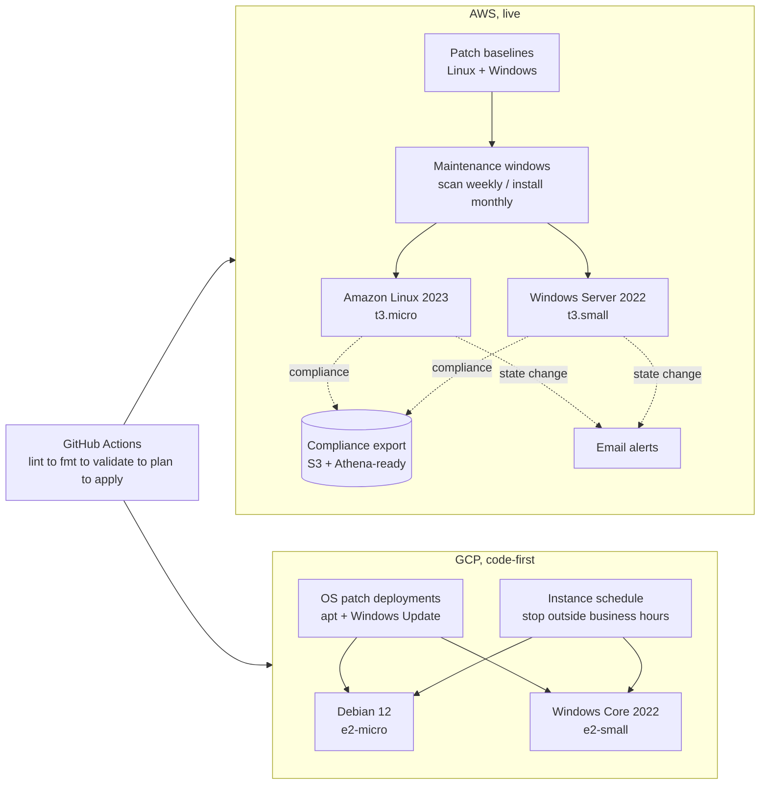

# Multi-Cloud Patch Management

Automated OS patching and vulnerability remediation for **Linux and Windows**
on two clouds, managed end-to-end with Terraform and GitHub Actions.

| Cloud | Service | Status |
|-------|---------|--------|
| AWS | Systems Manager **Patch Manager** (baselines, maintenance windows, compliance export, alerts) | Live |
| GCP | Compute Engine **VM Manager** (OS patch deployments, instance schedules) | Code-first (deploy-ready, applied when the GCP account exists) |


---

## Architecture



**The same pattern on both clouds:** a patch policy per OS family to a schedule
that enforces it to reporting you can prove compliance with. The mechanics
differ (SSM baselines vs OS patch deployments), the platform-engineering
problem is identical.

## What's inside

```
cloud-patch-automation/
├── aws/                 # Terraform, SSM Patch Manager (LIVE)
│   ├── ssm.tf           #   patch baselines, maintenance windows, tasks, inventory
│   ├── instances.tf     #   demo VMs (opt-in via enable_demo_vms)
│   ├── reporting.tf     #   S3 resource data sync + EventBridge to SNS email alerts
│   └── iam.tf           #   instance role (AmazonSSMManagedInstanceCore only)
├── gcp/                 # Terraform, VM Manager (code-first)
│   ├── osconfig.tf      #   monthly patch deployments (apt + Windows Update)
│   └── instances.tf     #   demo VMs + instance schedule (cost guardrail)
├── .github/workflows/terraform-ci.yml
└── docs/
    ├── aws-patching.md  # demo walkthrough + evidence checklist
    └── gcp-patching.md  # runbook for when the GCP account arrives
```

## Key decisions

- **3-day auto-approval delay** on every patch baseline, if AWS/GCP pulls a
  bad patch, the fleet never sees it. This is the "canary" of patching.
- **Windows is a first-class citizen**, `UpdateRollups` classification on AWS,
  `UPDATE_ROLLUP` on GCP. Most patch demos are Linux-only; production fleets
  are not.
- **No SSH/RDP keys anywhere**, instances are SSM/OS-Config-agent managed
  only. Patch jobs reach the agent outbound; humans use Session Manager.
- **Demo VMs are opt-in** (`enable_demo_vms = false` by default) and the GCP
  fleet is additionally stopped outside business hours by an instance
  schedule, patching infra should be reviewable without burning money.
- **Compliance is exportable, not just screenshot-able**, SSM resource data
  sync streams JSON to S3 (Athena-queryable); GCP exposes OS Inventory in the
  console.

## CI/CD pipeline

`terraform-ci.yml` runs on every PR touching `aws/**` or `gcp/**`:

| Job | Trigger | Auth |
|-----|---------|------|
| `lint` (tflint + actionlint) | PR / main | none |
| `fmt` (`terraform fmt -check`) | PR / main | none |
| `validate` (aws + gcp, `-backend=false`) | PR / main | **none, this is how code-first GCP proves deploy-readiness** |
| `plan-aws` to comments plan on the PR | PR | GitHub OIDC to read-only `plan` role |
| `apply-aws` | main | GitHub OIDC to main-only `apply` role |
| `gcp` (plan/apply, manual) | workflow_dispatch | self-skips until GCP variables exist, see [gcp-patching.md](docs/gcp-patching.md) |

No static AWS keys anywhere. Roles are provisioned by
[terraform-bootstrap](https://github.com/pebrisulistiyo/terraform-bootstrap).

## Local usage

```bash
# AWS (live)
cd aws
cp backend.hcl.example backend.hcl      # shared portfolio state bucket
cp terraform.tfvars.example terraform.tfvars
terraform init -backend-config=backend.hcl
terraform plan
terraform apply                          # infra only, VMs stay off

# GCP (code-first: validate only, no account needed)
cd gcp
terraform init -backend=false && terraform validate
```

### Demo session (AWS), see [docs/aws-patching.md](docs/aws-patching.md)

1. `enable_demo_vms = true` to `terraform apply`
2. Wait ~15 min for inventory to collect
3. Run a scan via the maintenance window (or on demand) to screenshot Patch
   Manager compliance
4. Verify the S3 export + email alert
5. `terraform destroy`

## Cost model (approximate, ap-southeast-1 / asia-southeast1)

| Item | ~Cost if running 24/7 | Guardrail |
|------|----------------------|-----------|
| Amazon Linux 2023 `t3.micro` | ~$7.60/mo | `enable_demo_vms=false`; destroy after demo |
| Windows Server 2022 `t3.small` | ~$40–45/mo | same + AWS budgets ($20/$50/$80) from bootstrap |
| Debian `e2-micro` | ~$5.60/mo | instance schedule stops it outside business hours |
| Windows Core 2022 `e2-small` | ~$45–50/mo | same + GCP billing budget $10/mo (when account arrives) |
| SSM / VM Manager / S3 / SNS | $0 at demo volume |, |

## Evidence (screenshots)

| AWS Patch Manager compliance | S3 compliance export | GCP VM Manager patch jobs |
|------------------------------|----------------------|---------------------------|
| pending, to be captured in demo session | pending | pending (after GCP account arrives) |

## Trade-offs worth mentioning

- **Compliance data goes to S3, not a warehouse**, Athena can query it in
  place; a dedicated warehouse would be overkill for a demo.
- **One patch group for both OSes**, Patch Manager routes each instance to
  the baseline matching its OS, so a single tag value covers the mixed fleet.
- **GCP reporting is console-based (OS Inventory)**, lean;
  exporting to BigQuery would be the natural next step.
